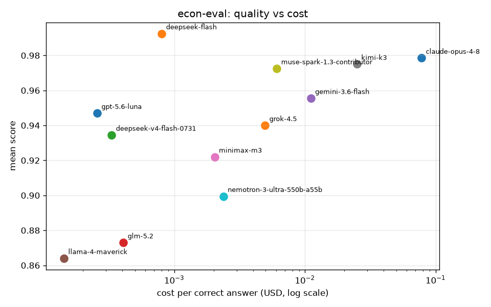

# econ-eval

A reproducible benchmark that asks a single question: **on the work an
economist actually does, how much do you give up by using a cheap model?**

Twelve models answer the same 20 tasks, five times each (1,200 completions), across
four tracks: quantitative trade/macro computation, economic reasoning, domain
coding, and policy writing. Objective tracks are graded deterministically
(numeric tolerance, sandboxed code execution). Subjective tracks are rubric
graded by Claude Opus 5. Every score carries a bootstrap 95% CI, and every
challenger is compared to Claude Opus 4.8 with an exact binomial sign test.

Ten models ran 2026-08-01. DeepSeek V4.1 Flash, released 2026-09-10, and Meta
Muse Spark 1.3 were added the same day on the same tasks, same samples, same
judge. All 1,200 completions graded, all 600 subjective rows scored by a single
judge. Raw output:
[`results/report-2026-09-10.md`](results/report-2026-09-10.md) (the ten-model
run is preserved in `results/report-2026-08-01.md`), quality-vs-cost plot at
`results/plot-2026-09-10.png`, per-sample scores in `results/scores.sqlite`.



Published on Hugging Face as the dataset
[deluair/econ-eval](https://huggingface.co/datasets/deluair/econ-eval) (tasks,
per-completion scores, transcripts, both leaderboards) with a static
leaderboard at [huggingface.co/spaces/deluair/econ-eval](https://huggingface.co/spaces/deluair/econ-eval).
`scripts/export_hf.py` regenerates both from `results/scores.sqlite`.

## Leaderboard

| # | model | score | 95% CI | total cost | cost per correct | vs Opus |
|---|---|---|---|---|---|---|
| 1 | deepseek-flash (V4.1) | 0.992 | [0.975, 1.000] | $0.0803 | $0.000803 | tied (p=0.375) |
| 2 | claude-opus-4-8 | 0.979 | [0.951, 0.997] | $7.8015 | $0.078015 | reference |
| 3 | moonshotai/kimi-k3 | 0.975 | [0.949, 0.996] | $2.5008 | $0.025008 | tied (p=1.000) |
| 4 | muse-spark-1.3-contributor | 0.972 | [0.930, 1.000] | $0.5977 | $0.006099 | tied (p=0.727) |
| 5 | google/gemini-3.6-flash | 0.956 | [0.918, 0.988] | $1.1091 | $0.011091 | tied (p=0.125) |
| 6 | openai/gpt-5.6-luna | 0.947 | [0.905, 0.984] | $0.0257 | $0.000257 | tied (p=0.125) |
| 7 | x-ai/grok-4.5 | 0.940 | [0.895, 0.980] | $0.4953 | $0.004953 | loses (p=0.016) |
| 8 | deepseek/deepseek-v4-flash-0731 | 0.934 | [0.889, 0.975] | $0.0332 | $0.000332 | loses (p=0.008) |
| 9 | minimax/minimax-m3 | 0.922 | [0.866, 0.969] | $0.1974 | $0.002035 | loses (p=0.004) |
| 10 | nvidia/nemotron-3-ultra-550b-a55b | 0.899 | [0.809, 0.973] | $0.2210 | $0.002377 | loses (p=0.031) |
| 11 | glm-5.2 | 0.873 | [0.761, 0.949] | $0.0388 | $0.000408 | loses (p=0.002) |
| 12 | meta-llama/llama-4-maverick | 0.864 | [0.783, 0.934] | $0.0139 | $0.000143 | loses (p=0.002) |

Score is the mean over 20 tasks of each task's mean over 5 samples. Cost covers
all 100 completions per model. "vs Opus" is an exact two-sided sign test on
per-task means, alpha = 0.05.

**The headline (2026-09-10): DeepSeek V4.1 Flash, on its release day, is the
first model to outscore Opus 4.8 on this suite, 0.992 to 0.979, at 1/97th the
cost per correct answer.** It is perfect on all three non-writing tracks and
tops the writing track. It beats Opus on four of the five tasks where they
differ and loses one (the Bangla op-ed, 0.90 vs 0.95), which with 20 tasks does
not clear significance (p = 0.375): a statistical tie, in its favour. The
2026-08-01 headline still holds underneath: `gpt-5.6-luna` scores 0.947,
indistinguishable from Opus (p = 0.125) at 1/304th the cost per correct answer.
Five models survive the Opus comparison: DeepSeek V4.1 Flash, Kimi K3, Muse
Spark 1.3, Gemini 3.6 Flash, and Luna. Six do not.

Meta's Muse Spark 1.3, run through the Muse Code CLI on its subscription,
places fourth at 0.972. It tops the writing track (0.980) and is the only model
perfect on both Bangla tasks, but it is an agent, not a bare completion: twice
it ran its own verification and appended the output to code it was told to
return alone, and the grader scored both samples as failures. Without those two
format slips it would sit at 0.992, level with DeepSeek.

The cost column is not like for like, and correcting it does not change the
conclusion. Opus runs through the `claude` CLI, so its `input_tokens` carry the
entire Claude Code harness context: 8,287 tokens per call against a 101-token
median for the raw API models. Substituting that median and keeping Opus's real
output tokens gives **$3.7088 total, $0.037088 per correct**, still 144x Luna.
Both figures are reported so neither flatters the result. Muse Spark carries
the same caveat, at 57,539 input tokens per call through the Muse Code CLI,
priced here at Meta's contributor API rate although the run itself was
subscription prompts.

## Which track separates the models

Not all four tracks carry information. Spread between best and worst model:

| track | best | worst | spread | verdict |
|---|---|---|---|---|
| coding | 1.000 | 0.920 | 0.080 | saturated, near-useless for ranking |
| reasoning | 1.000 | 0.828 | 0.172 | mild separation |
| quantitative | 1.000 | 0.800 | 0.200 | separation from one task |
| writing | 0.980 | 0.638 | 0.342 | **the discriminating track** |

Ten of twelve models score a perfect 1.000 on coding, and eight do on
quantitative. If this benchmark were objective-only it would report a
twelve-way tie and no significant differences anywhere, which is exactly what
it reported before the subjective tracks were graded. **The ranking above exists because of
the writing and reasoning tracks.**

### Per-track detail

| model | quantitative | reasoning | coding | writing |
|---|---|---|---|---|
| deepseek-flash (V4.1) | 1.000 | 1.000 | 1.000 | 0.970 |
| claude-opus-4-8 | 1.000 | 1.000 | 1.000 | 0.914 |
| moonshotai/kimi-k3 | 1.000 | 1.000 | 1.000 | 0.900 |
| muse-spark-1.3-contributor | 1.000 | 0.990 | **0.920** | **0.980** |
| google/gemini-3.6-flash | 1.000 | 0.970 | 1.000 | 0.852 |
| openai/gpt-5.6-luna | 1.000 | 0.926 | 1.000 | 0.862 |
| x-ai/grok-4.5 | 1.000 | 0.934 | 1.000 | 0.826 |
| deepseek/deepseek-v4-flash-0731 | 1.000 | 0.932 | 1.000 | 0.806 |
| minimax/minimax-m3 | 0.960 | 0.892 | 0.960 | 0.876 |
| nvidia/nemotron-3-ultra-550b-a55b | 0.960 | 1.000 | 1.000 | **0.638** |
| glm-5.2 | 0.800 | 0.872 | 1.000 | 0.820 |
| meta-llama/llama-4-maverick | 0.920 | 0.828 | 1.000 | 0.708 |

### Which tasks did any work

Spread is max minus min model score on that task. A task with spread 0.000
separates nothing and is pure ballast.

| task | track | mean | worst model | spread |
|---|---|---|---|---|
| quant-rca-6109 | quantitative | 0.850 | 0.000 | **1.000** |
| write-bangla-formal | writing | 0.823 | 0.400 | **0.600** |
| write-oped-bangla | writing | 0.862 | 0.400 | **0.600** |
| write-policy-brief | writing | 0.821 | 0.500 | 0.500 |
| reason-taka-depreciation | reasoning | 0.875 | 0.700 | 0.300 |
| reason-export-diversification | reasoning | 0.946 | 0.750 | 0.250 |
| reason-rca-interpretation | reasoning | 0.950 | 0.760 | 0.240 |
| code-cagr | coding | 0.967 | 0.800 | 0.200 |
| code-rca | coding | 0.983 | 0.800 | 0.200 |
| reason-passthrough-netting | reasoning | 0.960 | 0.800 | 0.200 |
| write-exec-summary | writing | 0.800 | 0.750 | 0.200 |
| write-tight-constraints | writing | 0.923 | 0.840 | 0.160 |
| reason-ldc-graduation | reasoning | 0.996 | 0.950 | 0.050 |
| quant-cotton-share | quantitative | 1.000 | 1.000 | 0.000 |
| quant-hs6109-sum | quantitative | 1.000 | 1.000 | 0.000 |
| quant-trade-balance | quantitative | 1.000 | 1.000 | 0.000 |
| quant-unit-trap | quantitative | 1.000 | 1.000 | 0.000 |
| code-aggregate | coding | 1.000 | 1.000 | 0.000 |
| code-hhi | coding | 1.000 | 1.000 | 0.000 |
| code-method-of-reflections | coding | 1.000 | 1.000 | 0.000 |

**Seven of twenty tasks are dead weight**: every model scores 1.000, including
`quant-unit-trap`, which was written specifically to catch unit errors and
caught none. Three tasks (one RCA, two Bangla) carry most of the discrimination.
The benchmark is doing real work with roughly a third of its surface area.

Keep the dead tasks as regression tests, since a future model failing
`code-hhi` would be worth knowing, but do not read the leaderboard as if all 20
contributed.

## Three failure modes worth knowing

### 1. Bangla is where the cheap models actually fall over

Nemotron 3 Ultra scores a perfect 1.000 on reasoning and coding, then collapses
to 0.638 on writing. The collapse is entirely linguistic: 0.75 to 0.84 on the
three English writing tasks, 0.40 on both Bangla ones. Mean score across the two
Bangla tasks:

| model | Bangla |
|---|---|
| muse-spark-1.3-contributor | 1.000 |
| claude-opus-4-8 | 0.955 |
| deepseek-flash (V4.1) | 0.950 |
| openai/gpt-5.6-luna | 0.920 |
| moonshotai/kimi-k3 | 0.895 |
| google/gemini-3.6-flash | 0.895 |
| minimax/minimax-m3 | 0.885 |
| deepseek/deepseek-v4-flash-0731 | 0.870 |
| x-ai/grok-4.5 | 0.855 |
| glm-5.2 | 0.805 |
| meta-llama/llama-4-maverick | 0.685 |
| nvidia/nemotron-3-ultra-550b-a55b | 0.400 |

Nemotron does emit Bangla script, so this is not a refusal or an
encoding failure. It emits *worse* Bangla: 71% Bangla characters against a
consistent 85% for everyone else, the rest being transliterated English where a
Bangla term exists, which the rubric explicitly penalises. Its five samples
score 0.4, 0.2, 0.4, 0.4, 0.6, so the weakness is consistent rather than noise.
For Bangla-language policy work, the cheap tier is not interchangeable and the
English scores will not warn you.

### 2. A confident order-of-magnitude error

Nine of the twelve objective failures land on one task, `quant-rca-6109`, which
asks for a Balassa RCA from four raw trade values with no intermediate
scaffolding:

> RCA = (9,288,364.183 / 65,871,533.413) / (52,091,992.664 / 24,145,991,347.414) = 65.36

| model | task | fails | detail | kind |
|---|---|---|---|---|
| glm-5.2 | quant-rca-6109 | 5/5 | got 6.58, ref 65.36 | order-of-magnitude slip |
| meta-llama/llama-4-maverick | quant-rca-6109 | 2/5 | got 64.09 | precision, 1.94% against a 0.5% tolerance |
| minimax/minimax-m3 | quant-rca-6109 | 1/5 | no number found | format |
| nvidia/nemotron-3-ultra | quant-rca-6109 | 1/5 | no number found | format |
| minimax/minimax-m3 | code-cagr | 1/5 | `NameError: name 'cagr' is not defined` | code |
| muse-spark-1.3-contributor | code-rca | 1/5 | correct code, then an unfenced "Verified: ..." line | format |
| muse-spark-1.3-contributor | code-cagr | 1/5 | largest fenced block was its own test output, not the code | format |

GLM 5.2 returns 6.58 on all five samples, low by a factor of 9.93, while
producing confident well-formatted output. That is the failure mode that
matters for economics work: nothing downstream flags it. This reproduces a
finding from the earlier two-model run (commit 52c09a7). Llama's 64.09 is a
different animal, arithmetically close and passing at a 2% tolerance; whether
it counts as a failure is a policy choice this benchmark makes explicit.

### 3. Verbosity, not headline price, drives cost

| model | mean latency (s) | output tokens per call |
|---|---|---|
| moonshotai/kimi-k3 | 48.7 | 1,635 |
| muse-spark-1.3-contributor | 41.6 | 1,114 |
| claude-opus-4-8 | 22.5 | 1,463 |
| deepseek/deepseek-v4-flash-0731 | 19.5 | 1,126 |
| minimax/minimax-m3 | 17.7 | 1,586 |
| x-ai/grok-4.5 | 12.5 | 731 |
| google/gemini-3.6-flash | 7.4 | 1,462 |
| deepseek-flash (V4.1) | 6.9 | 1,311 |
| openai/gpt-5.6-luna | 5.4 | 414 |
| glm-5.2 | 5.4 | 153 |
| nvidia/nemotron-3-ultra-550b-a55b | 4.8 | 597 |
| meta-llama/llama-4-maverick | 4.8 | 152 |

Gemini 3.6 Flash costs 43x more per correct answer than Luna while being only
12.5x more expensive per output token. The remainder is verbosity: 1,462 output
tokens per call against Luna's 414. Kimi K3 buys its statistical tie with Opus
at 3.1x less cost, but at 9x Luna's latency and the slowest wall clock in the
field. GLM 5.2 and Llama 4 Maverick are the terse ones at ~150 tokens per call,
which is most of why they are the cheapest per correct answer despite ranking
9th and 10th on quality.

Latencies were measured with up to ten evals running in parallel (five for the
DeepSeek V4.1 Flash and Muse Spark runs), so treat them as relative rather than
clean single-stream numbers. Muse's 41.6 s is mostly CLI startup and its
agent's tool steps, not generation. V4.1 Flash's 1,311 output tokens per call include its
hidden thinking, which the DeepSeek endpoint bills as output.

## Models

| adapter | model id | access path | $/M in | $/M out |
|---|---|---|---|---|
| fable | `claude-fable-5-1` | `claude` CLI, subscription (2026-09-15 run) | 10.00 | 50.00 |
| astra | `gpt-6-astra` | `codex exec` CLI, ChatGPT plan, reasoning high (2026-09-15 run) | subscription | subscription |
| gemini-3.8-flash | `gemini-3.8-flash-high` | `agy` CLI, Google AI Ultra (2026-09-15 run) | subscription | subscription |
| opus | `claude-opus-4-8` | `claude` CLI, subscription | 5.00 | 25.00 |
| glm | `glm-5.2` | z.ai direct, Anthropic-compatible | 0.60 | 2.20 |
| deepseek-flash | `deepseek-flash` (V4.1 Flash) | DeepSeek direct, Anthropic-compatible | 0.15 | 0.60 |
| muse | `muse-spark-1.3-contributor` | `muse` CLI (Muse Code), subscription | 0.10 | 0.20 |
| gemini-flash | `google/gemini-3.6-flash` | OpenRouter | 1.50 | 7.50 |
| deepseek-0731 | `deepseek/deepseek-v4-flash-0731` | OpenRouter | 0.14 | 0.28 |
| kimi-k3 | `moonshotai/kimi-k3` | OpenRouter | 3.00 | 15.00 |
| nemotron-ultra | `nvidia/nemotron-3-ultra-550b-a55b` | OpenRouter | 0.60 | 3.60 |
| minimax-m3 | `minimax/minimax-m3` | OpenRouter | 0.30 | 1.20 |
| luna | `openai/gpt-5.6-luna` | OpenRouter | 0.10 | 0.60 |
| grok | `x-ai/grok-4.5` | OpenRouter | 2.00 | 6.00 |
| llama | `meta-llama/llama-4-maverick` | OpenRouter | 0.20 | 0.80 |

Prices are USD per 1M tokens, read from the OpenRouter catalog API on
2026-07-31 and stored in `econ_eval/config.py`. Fable 5.1 is the Anthropic
API list price (2026-06-24 model table). GPT-6 Astra and Gemini 3.8 Flash have
no API price: both are served only through subscriptions, so their cost column
is zero and their token counts include their CLI harness context (about 25k and
13k input tokens per call). Two notes on selection:
`kimi-k3` at $3.00/$15.00 is not a cheap model and is included only because it
was requested by name, and `llama-4-maverick` is the newest Meta model in the
catalog, since there is no Llama 5.

## Task suite

Fifty tasks, 5 samples each: the twenty original tasks of 2026-06-22 (five
per track) and thirty "daily work" tasks added 2026-09-15, built from the work
the author does every day: trade computations on the platform's own BACI
parquet, bank and systemic-risk arithmetic, the small functions a trade data
pipeline needs, checking a colleague's numbers, refereeing, briefing a coding
agent, and the daily writing (a post, a cover paragraph, a plain-Bengali
explanation, an abstract, a recruiter reply). Every task carries a `source`
field and the loader refuses to construct one without it.

| track | tasks | grader | how it is scored |
|---|---|---|---|
| quantitative | 11 | `numeric` | parse the `ANSWER:` line, compare to a reference within a per-task relative tolerance (0.5% for RCA) |
| finance | 5 | `numeric` | same: SRISK, Eisenberg-Noe clearing, CET1, ACM term premium, Fisher real rate |
| coding | 10 | `code_exec` | execute the returned code in a sandbox against assertions |
| reasoning | 10 | `judge` (5) and `numeric` (5) | rubric points for the 2026-06-22 tasks; exact arithmetic for the 2026-09-15 ones |
| review | 4 | `judge` | consistency check, referee comment, agent brief, systemd timer |
| writing | 10 | `judge` | model judge scores each rubric point 0 or 1, including three Bangla-language tasks |

```
quant-cotton-share      quant-hs6109-sum     quant-rca-6109
quant-trade-balance     quant-unit-trap
code-aggregate          code-cagr            code-hhi
code-method-of-reflections                   code-rca
reason-export-diversification                reason-ldc-graduation
reason-passthrough-netting                   reason-rca-interpretation
reason-taka-depreciation
write-bangla-formal     write-exec-summary   write-oped-bangla
write-policy-brief      write-tight-constraints

# added 2026-09-15
quant-cagr-decade       quant-growth-year    quant-rmg-share-change
quant-bilateral-india   quant-rca-pick       quant-tariff-weighted
fin-srisk               fin-eisenberg-noe    fin-cet1
fin-term-premium        fin-real-rate
code-hs-normalize       code-pct-consistency code-sqlite-top3
code-eisenberg-noe      code-kusd-format
reason-terms-of-trade   reason-real-depreciation
reason-remittance-fx    reason-hysa-interest reason-gravity-coef
review-consistency      review-referee-comment
review-agent-brief      review-systemd-timer
write-x-post            write-cover-paragraph
write-bangla-plain-remittance                write-abstract-150
write-recruiter-reply
```

Reference values are computed by `scripts/build_references.py` (2026-06-22
tasks) and `scripts/build_references_daily.py` (2026-09-15 tasks) from primary
data: BACI 2013, 2022 and 2023 and WTO applied MFN lines via the TradeWeave
parquet tree, the NY Fed ACM term-structure series via the FinObservatory
parquet tree, and stated formulas (Brownlees-Engle SRISK, Eisenberg-Noe,
Basel III, Fisher) on author-defined inputs. No fabricated values. The RCA
reference was re-derived from its four inputs during the first run and
matched to four decimal places.

Task files are effectively append-only: editing a prompt invalidates every
cached completion for it. Add tasks, do not rewrite them.

## Grading

**Objective tracks** need no judge. `numeric` extracts the answer and applies a
relative tolerance; a missing or unparsable number scores 0, which is why "no
number found" appears as a failure mode. `code_exec` runs the model's code
against assertions and scores 0 on any exception.

**Subjective tracks** are rubric graded: the judge sees the task, the answer,
and a numbered rubric, and returns a JSON map of rubric index to 0 or 1. Score
is the fraction of rubric points hit; pass is >= 0.5. The judge never sees which
model produced an answer, and rubric grading is absolute rather than
comparative, so there is no position bias to cancel. A pairwise, order-swapped
comparator exists in `econ_eval/graders/judge.py` for A/B use. A representative
rubric, from `write-bangla-formal`:

```
0  Written in fluent, grammatically correct Bangla
1  Formal administrative / policy-memo register (not casual, not op-ed)
2  Uses correct Bangla economic terms rather than transliterated English
3  Recommends one concrete, specific diversification step
4  Coherent and within 90 to 120 words
```

The judge is **Claude Opus 5** (`claude-opus-5`), called through the same
`claude` CLI as the Opus 4.8 contestant. Two caveats stated plainly:

1. **The judge is not neutral.** Opus 5 grading Opus 4.8 is same-family
   refereeing, and Opus 4.8's subjective scores should be read with that in
   mind. Its top-line lead comes from the writing track, which is judged. The
   objective tracks are immune, being deterministically graded, and there Opus
   ties five other models exactly.
2. **All 500 subjective rows are graded by one judge.** Judges are not
   interchangeable, so mixing them would void cross-model comparison. When the
   judge changed, every row was regraded, not just the ungraded ones.
   `DONE_PREFIX` in `scripts/regrade_judge.py` enforces this: changing judges
   means changing that string, which invalidates every existing grade.

## Statistics

- **Point score**: mean over tasks of each task's mean over its 5 samples, so a
  task with more samples cannot dominate.
- **95% CI**: percentile bootstrap, 5,000 iterations, seed 0. Resamples tasks
  with replacement, and within each resampled task resamples its samples. This
  is a task-level CI, so it widens when models disagree across tasks rather
  than across repeats of one task.
- **Head to head**: exact two-sided binomial sign test on per-task mean
  differences, ties dropped, alpha = 0.05. The harness refuses to name a winner
  above that threshold, which is why three models are reported as tied with
  Opus rather than ranked below it.

Pure numpy, no scipy. Deterministic given the seed.

With 20 tasks, the sign test needs a challenger to lose 7 or more decided tasks
without winning any to reach p < 0.05. That is a coarse instrument: it cannot
distinguish "as good as Opus" from "not yet proven worse". Read the three ties
as the latter.

## Setup

```bash
make setup                      # uv sync
export OPENROUTER_API_KEY=...   # the 8-model fleet (OPENAI_API_KEY also accepted)
export ZAI_API_KEY=...          # GLM 5.2 direct
export DEEPSEEK_API_KEY=...     # DeepSeek V4.1 Flash direct (must be exported, not just set)
# Opus, Fable and the Opus 5 judge run through the `claude` CLI under your Claude
# Code login; Astra through `codex` (ChatGPT login); Gemini 3.8 Flash through
# `agy` (Google login); Muse through `muse`. No API key for any of those, and
# never export ANTHROPIC_API_KEY before an eval (the CLI judge would switch to it).
```

## Use

```bash
make probe    # confirm every contestant and the judge are reachable
make dry      # print task and call counts, no model calls
make eval     # all tasks x all models x N=5, graded and cached
make report   # results/report-<date>.md plus the quality-vs-cost plot
make test     # 80 unit tests, no live calls

# one model at a time, which is how the fleet was actually run
uv run python -m econ_eval --date <date> eval -n 5 --models grok
# k parallel workers of one model, each taking every k-th task (shared cache)
uv run python -m econ_eval --date <date> eval --models fable --shard 0/3
# report a subset of tracks, or of models (ids as stored in the DB)
uv run python -m econ_eval --date <date> report --tracks quantitative,coding
uv run python -m econ_eval --date <date> report --models claude-fable-5-1,gpt-6-astra
# the 2026-09-15 run as launched (3 shards per CLI model, 2 for DeepSeek)
scripts/run_2026_09_15.sh
# regrade every judge row after changing judges (16 workers by default)
REGRADE_WORKERS=16 uv run python scripts/regrade_judge.py results/transcripts-*.jsonl
```

The runner is resumable and keyed on (task, model, sample index): rerunning
fills only what is missing. Scored rows go to `results/scores.sqlite` (tracked
in git), transcripts to `results/transcripts-*.jsonl` (gitignored, backed up to
Google Drive by `backup.sh`).

Running one process per model in parallel is safe; SQLite is opened with
`busy_timeout=60000`. Sixteen concurrent `claude` CLI calls are also fine:
measured by wall clock, the judge regrade ran 402 rows in 208s at 16 workers
(116 rows/min) against 98 rows in 231s at 3 workers (25.5 rows/min). That is
4.6x for 5.3x the workers, so scaling is sublinear and per-call CLI startup
dominates. Note that the CLI reports credit exhaustion as either exit 1 with
empty stderr or exit 0 with an `api_error` envelope, and the first form is easy
to misread as a concurrency fault. The tell is that a credit wall fails every
retry instantly with zero rows completed.

## What this benchmark cannot yet tell you

Coding is saturated and quantitative is close, so most of the ranking rests on
two judged tracks and a single arithmetic task. Concretely:

- **The objective tasks are too easy.** They were built to be verifiable
  against primary data, and verifiable correlated with easy. The one task that
  separates the field does it by removing scaffolding, not by adding
  difficulty.
- **The judged tracks carry the ranking, and the judge is related to one
  contestant.** A neutral judge with sufficient quota would strengthen every
  subjective conclusion here.
- **20 tasks is a coarse sign test.** Three ties with Opus mean "not proven
  worse", not "proven equal".

The next tasks worth adding follow the RCA pattern: multi-step chains where an
early unit error propagates, netting and aggregation traps, questions whose
correct answer is "the data does not support this", and more Bangla work, since
that is where the spread is widest and where the English scores are actively
misleading.

## Adding tasks

One YAML per task in `tasks/`. Required: `id`, `track`, `prompt`, `grader`,
`source`. The loader validates track and grader type and rejects a task with no
source. Quantitative references come from `scripts/build_references.py` against
primary data, never from a model and never from memory. See
`docs/CODEBASE_LEDGER.md` for conventions and known quirks, and
`docs/superpowers/specs/` for the original design.
